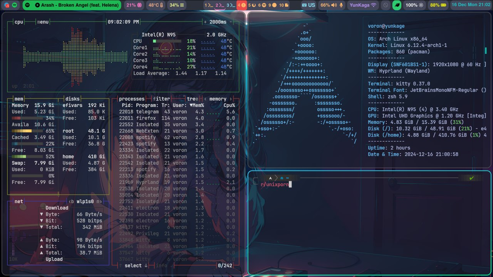

# Это мои файлы конфигурации

### Здесь вы можете найти мои конфигурации neovim, kitty, fasfetch, hyprland, waybar

###### в дальнейшем возможно добавление новых конфигураций :)

## Hyprland

## HyprPaper

#### обои

##### Anime-Girl1.png

## waybar

## Neovim

В нем присутствует плагин Mason. Установленные языковые серверы:

- clangd
- emmet-ls
- lua-language-server
- pyright
- typescript-language-server

