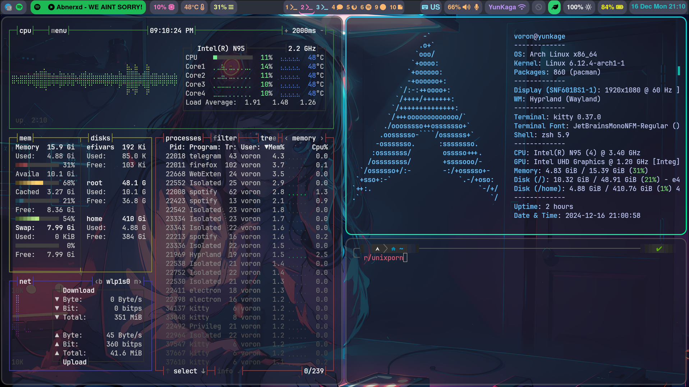
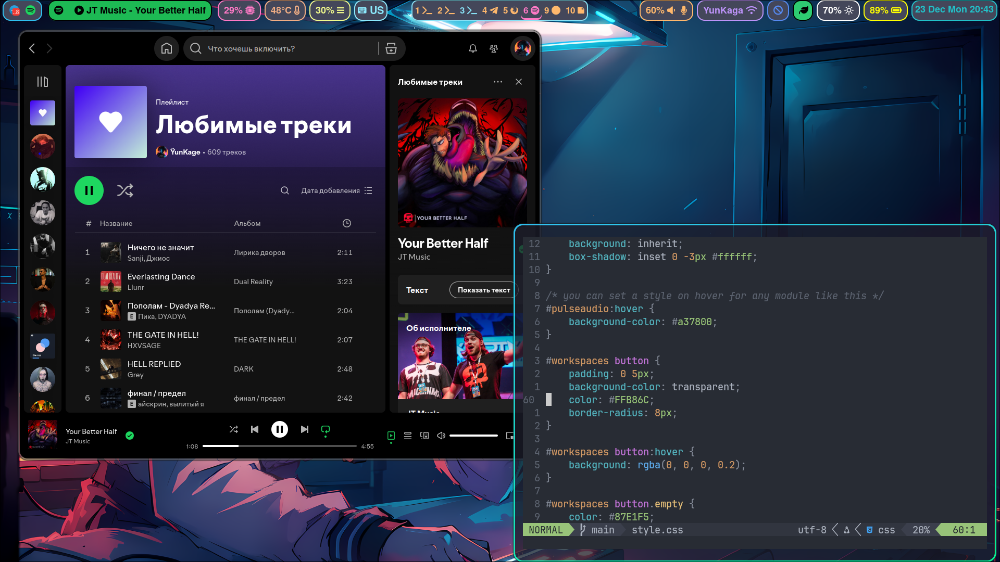

# Это мои файлы конфигурации

### Здесь вы можете найти мои конфигурации hyprland, hypeidle, hyprlock, waybar, neovim, mako, kitty, fasfetch

###### в дальнейшем возможно добавление новых конфигураций :)

## Hyprland

#### Для HyprLand использовались такие дополнения из экосистемы hypr, как:

+ [*hypridle*](https://github.com/hyprwm/hypridle)
+ [*hyprlock*](https://github.com/hyprwm/hyprlock)
+ [*hyprpicker*](https://github.com/hyprwm/hyprpicker)
+ [*hyprpaper*](https://github.com/hyprwm/hyprpaper)

#### Дополнительные программы

- mako - daemon уведомлений
- thunar - файловый менеджер
- wofi - меню вызова приложений

## HyprPaper

#### обои

##### Anime-Girl1.png

## waybar

### Модули слева:
+ tray
+ custom/spotify
+ cpu
+ temperature
+ memory
+ hyprland/language

### Модули по центру:
+ hyprland/workspaces

### Модули справа:
+ pulseaudio
+ network
+ bluetooth
+ backlight
+ battery
+ clock

#### Мелкие модификации:

- Количество символов в custom/spotify ограничено внутри waybar/scripts/mediaplayer.py
- Активный workspace подсвечен розовым, НЕ пустой - оранжевым, пустой - голубым

## Neovim

#### В нем присутствует плагин Mason. Установленные языковые серверы:

- clangd
- emmet-ls
- lua-language-server
- pyright
- typescript-language-server

#### *Тема:* [onedark:dark](https://github.com/navarasu/onedark.nvim)

## Kitty

### Используется командная оболочка zsh вместе с [Oh my zsh](https://ohmyz.sh/)

##### Шрифт: JetBrainsMono Nerd Font Mono

##### Добавлено сочетание клавиш Ctrl+Shift+o+1 для отключения прозрачности терминала и Ctrl+Shift+o+0 для включения
